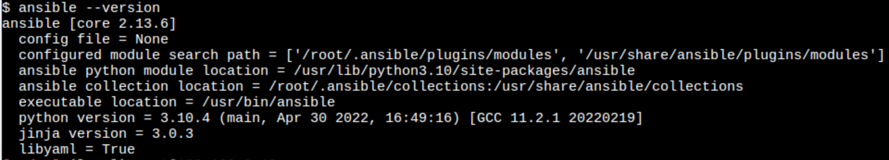

# example-install-ansible-and-vault

Summary : 
- Install ansible
- install python ? already installed pip is already integrated in python3
- create users
- install ssh or use it
- vault in ansible to hide password 

## install ansible on alpine linux
Step 1. Update official Alpine packages.
```
sudo apk update
```

Step 2. Install Ansible.
```
sudo apk add ansible
```

Step 3. Verify installation.
```
ansible --version
```
<p align="center">
<!---->

</p>
<p align="center">
The ansible version
</p>

## Avoid using the root account:
We create a user called 'admin'. So, run the following command (as the root user or with sudo privileges) :
```
useradd admin
```
We will be prompted to provide a password for this user, let's choose for example 'admin'.


